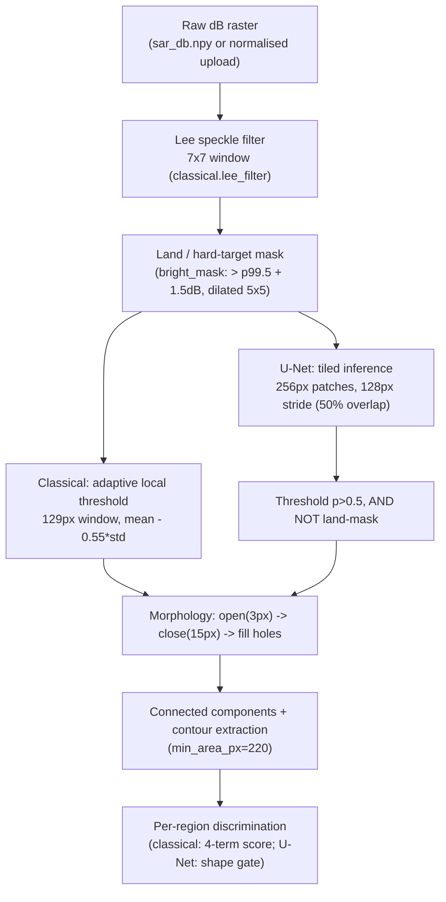
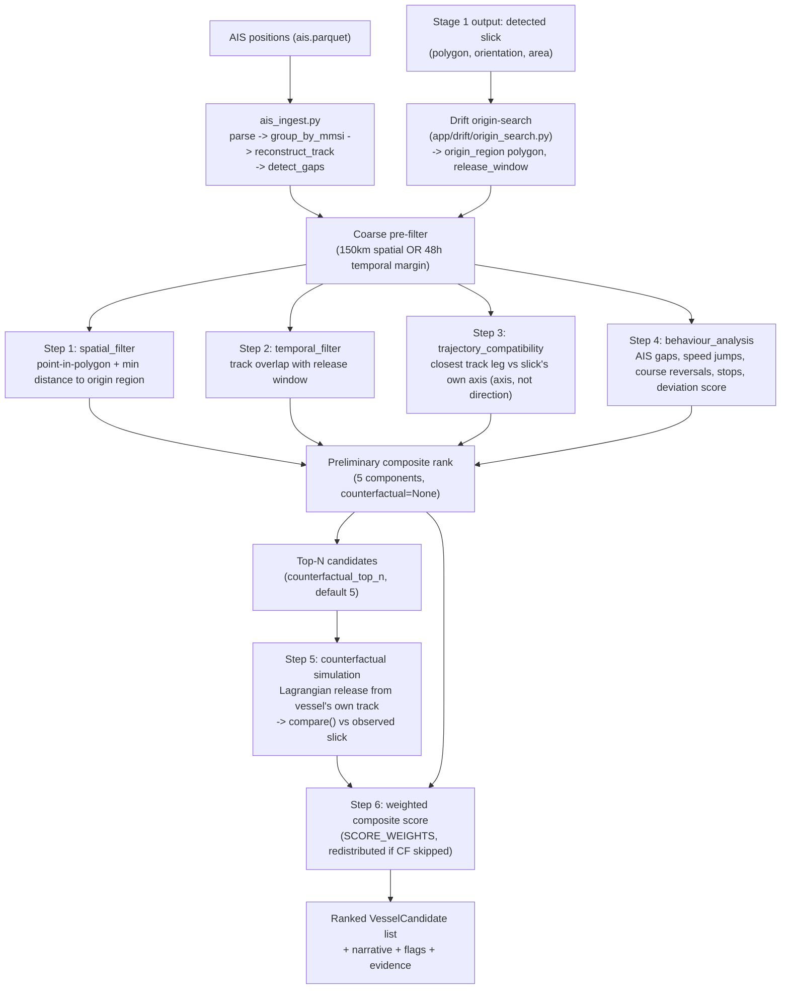
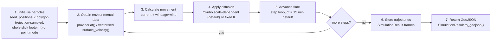
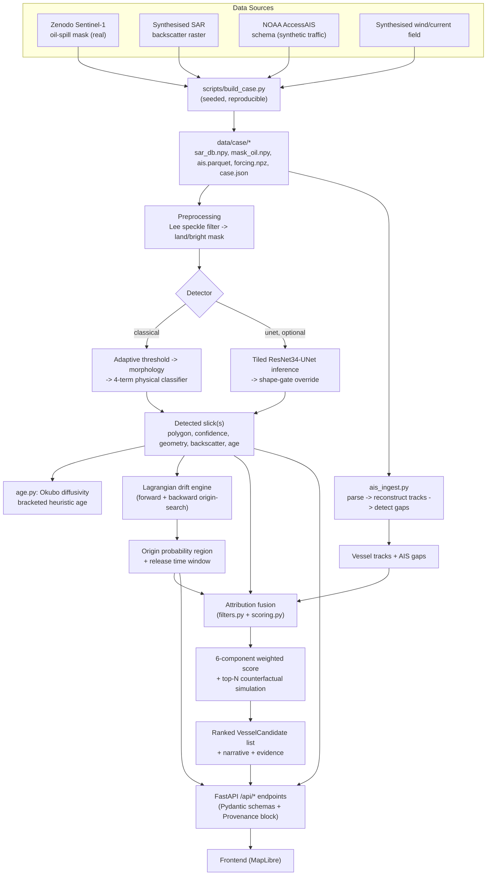

# Spill Trace — ML Pipeline (SIH PS 26143)

SAR oil-spill detection with AIS-based vessel attribution. This document describes the ML/analytics pipeline **as implemented in this repository** (`backend/app/`, `ml/`, `scripts/`). Anything not evidenced in code is marked `[TBD - x]` rather than assumed.

---

## 1. Problem scope + I/O spec

Two coupled tasks, run against one frozen case-study bundle (`data/case/`), built by `scripts/build_case.py`:

- **Stage 1 — Detection**: binary segmentation of SAR backscatter into oil-slick vs. sea/look-alike, with two interchangeable detectors sharing one interface (`(oil, lookalikes, steps)`):
  - **Classical** (`backend/app/detection/classical.py`) — deterministic, no learned weights, always available.
  - **U-Net** (`backend/app/detection/unet.py`) — optional learned upgrade, gated by shape heuristics from the classical path.
- **Stage 2 — Attribution**: fuses the detected slick with AIS vessel tracks to rank candidate vessels (`backend/app/attribution/`).

### I/O spec

| Stage | Input | Shape / dtype | Units | CRS |
|---|---|---|---|---|
| Detection input | `sar_db.npy` (case bundle) or uploaded PNG/JPEG/TIFF/BMP/WEBP | `(1024, 1024)` float32 for the frozen case (`config` `GRID=1024`); arbitrary `H×W` for uploads, downscaled so `max(H,W) ≤ 2048` | dB-like relative backscatter (calibrated Sentinel-1-style for the case bundle; percentile-normalised pseudo-dB for uploads — **not** physically calibrated Sigma0) | Case bundle: regular lon/lat grid over `bbox` (WGS84 / EPSG:4326), pixel→lonlat via `CaseBundle.pixel_to_lonlat` (linear interpolation across `bbox`, north-up). Uploads: local flat-earth approximation anchored at a user-supplied `(lon, lat)` centre and assumed GSD (`app/api/upload.py::_Anchor`) — never a real geotransform. |
| Detection output | `DetectResponse` (`app/core/schemas.py`) | per-region: polygon (GeoJSON `Polygon`, WGS84), `confidence` (0-1), `SlickGeometry` (`area_km2`, `length_km`, `width_km`, `aspect_ratio`, `elongation`, `orientation_deg`, `compactness`, `solidity`), `BackscatterStats` (`mean_db`, `std_db`, `contrast_db`, `variance_ratio`, `edge_gradient`), optional `AgeEstimate` | mixed (km, km², dB, degrees, hours) | WGS84 |
| Attribution input | AIS positions (`data/case/ais.parquet`: `MMSI, BaseDateTime, LAT, LON, SOG, COG, VesselName, VesselType`), origin polygon (GeoJSON, from drift origin-search), release time window | `MMSI` str, lat/lon float degrees, `SOG` knots, `COG` degrees | knots, degrees | WGS84 |
| Attribution output | `AttributeResponse`: ranked `VesselCandidate` list, each with `score` (0-1), six-component `ScoreBreakdown`, `flags`, `gaps`, `narrative`, `track` GeoJSON `LineString` | 0-1 composite score | WGS84 |

Model/pipeline version is a single string constant: `config.MODEL_VERSION = "spilltrace-0.1.0"`, surfaced in every response's `Provenance` block.

---

## 2. Data sources & ingestion

| Source | Kind | Real / synthetic | Resolution / cadence | Notes |
|---|---|---|---|---|
| Zenodo Sentinel-1 oil-spill mask `00250.tif` (Part I) | SAR mask (ground truth) | **Real** | `[TBD - original mask resolution]`, downsampled to working grid `1024×1024` | `https://zenodo.org/records/8346860`, CC BY 4.0. Provides real slick *shape*, not georeferencing — the case script positions/scales it (34 km trail length, Gulf of Mexico bbox). |
| Synthesised Sentinel-1-like VV backscatter | SAR raster | Synthetic | `1024×1024` | Rendered from the real Zenodo mask with gamma multi-look speckle, Bragg damping, wind streaks; stands in for the real 9.9 GB Sentinel-1 test scene. |
| Synthesised look-alike patches | SAR raster | Synthetic (2 patches) | — | Official Zenodo look-alike masks are empty by construction, so compact soft-edged patches are generated to force discriminator evaluation. |
| NOAA AccessAIS | AIS vessel traffic | Nominally real source format; **case bundle's actual traffic is synthetic** | Per-broadcast (typically seconds–minutes; case bundle is a single injected polluter track) | Real column schema (`MMSI, BaseDateTime, LAT, LON, SOG, COG, VesselName, VesselType`) parsed by `ais_ingest.py`; the day-file itself was not downloaded, so `case.json` records `is_synthetic: true` for this source. Ground-truth polluter: MMSI `367301820`, "MV KESTREL TRADER", 94-minute AIS-dark gap injected across the release window. |
| Synthesised wind + surface current field | Environmental forcing | Synthetic | `[TBD - forcing.npz grid resolution/timestep]`, mean flow ≈ 0.15 m/s NE + 22 km anticyclonic eddy | ERA5/CMEMS require accounts not configured in this environment; `app/environment/mock.py` and `app/environment/bundle.py` are the two providers, resolved via `app/environment/resolver.py` (`ENV_DATA_MODE=auto|mock`). |
| Kaggle "Deep-SAR oil-spill segmentation (refined)" (`bakhtiyar2222/...`) | U-Net training set | Real (external, public) | ALOS PALSAR / Sentinel-1 chips, `256×256` pre-normalized 8-bit, binary oil/not-oil masks | `ml/data/images/{train,val}` — **6455 train / 1615 val images** on disk. A *different* SAR collection than the frozen case study's raster; U-Net inference bridges this domain gap with a percentile stretch (`unet.py::_to_rgb_uint8`), an explicitly documented heuristic. |

Every source's real/synthetic status is recorded per-field in `data/case/case.json → sources[]` and surfaced in the frontend/API rather than silently faked — this is a deliberate house convention (`scripts/build_case.py` docstring).

`[TBD - real-time/production AIS ingestion cadence, feed provider, and SAR tasking cadence]` — the current system only replays one frozen bundle; there is no live ingestion pipeline in this repo.

---

## 3. Preprocessing steps (in order)

Both detectors (`classical.py`, `unet.py`) share the first two steps:



1. **Calibration**: for the case bundle, `sar_db.npy` is treated as already-calibrated dB (or dB-like); for uploads there is no real Sigma0, so `classical.normalise()` linearly maps 8-bit intensity onto a synthetic dB-like range `[-30, 0]` using 1st/99th percentile clipping (robust to outlier bright/dark pixels).
2. **Speckle filter**: Lee adaptive filter, `7×7` window (`lee_filter`) — blends toward local mean only where local variance is consistent with pure speckle, preserving edges.
3. **Land / hard-target mask**: pixels `> p99.5 + 1.5 dB`, dilated with a `5×5` kernel to swallow sidelobes (`bright_mask`). The case study is open ocean, so this only excludes vessels/rigs, not coastline.
4. **Threshold**:
   - Classical: adaptive — local mean/std over a `129 px` window, flag pixels `< mean - 0.55·std` (`adaptive_dark_mask`). Deliberately local (not global) because Sentinel-1 has an incidence-angle brightness ramp across the swath.
   - U-Net: fixed probability threshold `p > 0.5` on the sigmoid output, ANDed with the land mask.
5. **Tiling** (U-Net only): `256 px` patches, `128 px` stride (50% overlap), reflect-padded if the input is smaller than one patch; overlap-averaged on stitch to remove seam artefacts (`_predict_prob_map`).
6. **Normalization** (U-Net only): patches divided by 255, then ImageNet mean/std normalized (`[0.485,0.456,0.406]` / `[0.229,0.224,0.225]`) to match the pretrained-encoder's expected input distribution.
7. **Morphology**: binary open (`3 px` kernel) to drop isolated speckle, then close (`15 px` kernel, deliberately large) to bridge gaps in weakly-damped patches, then fill holes (`classical.clean`).
8. **Connected components + contours**: `scipy.ndimage.label`, region dropped if `area_px < 220`; contour via `cv2.findContours` + `approxPolyDP` (simplify tolerance `2.0 px`).
9. **Per-region discrimination**: classical 4-term weighted score, or U-Net probability + shape gate (Section 5/7).

---

## 4. Dataset construction (U-Net training set)

| Aspect | Value | Source |
|---|---|---|
| Images | `ml/data/images/{train,val}/*.png` | Kaggle Deep-SAR oil-spill segmentation (refined) |
| Masks | `ml/data/masks/{train,val}/*.png`, binarized at `>127` | Same dataset |
| Train count | 6455 | counted from `ml/data/images/train/` |
| Val count | 1615 | counted from `ml/data/images/val/` |
| Split strategy | `[TBD - split method]` — the train/val split is pre-baked into the downloaded dataset's directory layout (`train_unet_run.py` just reads `images/train` and `images/val` as-is); no split code exists in this repo, so leakage avoidance (e.g. by scene) cannot be confirmed from code. |
| Class imbalance handling | Not resampled explicitly. Loss combines BCE + Dice (`criterion = bce_loss + dice_loss`), which is a standard mitigation for imbalanced foreground/background segmentation, but no oversampling/class-weighting code is present. |
| Augmentation (train only) | `HorizontalFlip(p=0.5)`, `VerticalFlip(p=0.5)`, `RandomRotate90(p=0.5)`, `RandomBrightnessContrast(p=0.3)`, `GaussNoise(p=0.2)`, then `Normalize` (ImageNet mean/std) + `ToTensorV2` — via `albumentations` | `ml/train_unet_run.py` |
| Val transform | `Normalize` + `ToTensorV2` only (no augmentation) | `ml/train_unet_run.py` |

`[TBD - whether train/val images originate from disjoint source SAR scenes, i.e. no scene-level leakage]` — not verifiable from code; the dataset is consumed pre-split.

---

## 5. Model architecture

| Stage | Model | Notes |
|---|---|---|
| Classical detector | No learned model — physically-motivated 4-term rule (`classify()`), each term clipped to `[0,1]`: contrast (weight 0.34), variance-ratio/speckle damping (0.31), shape/compactness (0.23), edge sharpness (0.12). Threshold `score ≥ 0.45` → oil. | `backend/app/detection/classical.py` |
| U-Net detector | `segmentation_models_pytorch.Unet(encoder_name="resnet34", encoder_weights="imagenet", in_channels=3, classes=1)` | `ml/train_unet_run.py`, `backend/app/detection/unet.py` |

- **Backbone**: ResNet34, ImageNet-pretrained encoder (standard `smp.Unet` decoder — skip-connected upsampling to full resolution).
- **Input**: `3×256×256` (SAR dB raster is grayscale, replicated to 3 channels — `_to_rgb_uint8`).
- **Output**: `1×256×256` logits → sigmoid → per-pixel oil probability.
- **Loss**: `BCEWithLogitsLoss() + DiceLoss(mode="binary", from_logits=True)` — combined per `criterion()`.
- **Parameter count**: `[TBD - exact param count]` — not printed by the training script; ResNet34-encoder `smp.Unet` is a well-known architecture (~24.4M params is the standard published figure for this configuration, but that number is not verified from this repo's code/logs, so it is not asserted here).
- **Checkpoint size on disk**: `ml/weights/unet_best.pth` = 97,919,738 bytes (~93 MB).
- **Why chosen**: U-Net + ImageNet-pretrained ResNet encoder is the de facto standard for small-dataset binary segmentation (transfer learning reduces data need); explicitly framed in code as "Stage 1 — optional learned detector (Phase 7 upgrade)" layered on top of, never replacing, the always-available classical detector (`unet.py` module docstring) — a resilience/demo-safety design choice, not purely an accuracy one.

**Known limitation, stated in code**: the training set has no separate look-alike class. Run stand-alone, the network achieved 100% recall but only 5.9% precision on the frozen case study before a shape gate was added (round low-wind/biogenic blobs vs. elongated trails), because compact dark blobs get flagged as confidently as real trails.

---

## 6. Training setup

From `ml/train_unet_run.py` (headless mirror of `ml/train_unet.ipynb`):

| Parameter | Value |
|---|---|
| Hardware | `torch.device("cuda" if torch.cuda.is_available() else "cpu")` — auto-detected, no fixed target; `[TBD - actual GPU/CPU used for the checkpoint in ml/weights/]` |
| Image size | 256×256 |
| Batch size | 8 |
| Epochs (max) | 20, with early stopping |
| Early-stop patience | 5 epochs without val-IoU improvement |
| Optimizer | Adam, LR = 1e-4 |
| LR schedule | `ReduceLROnPlateau(mode="max", factor=0.5, patience=3)` on val IoU |
| Mixed precision | `torch.amp.autocast` + `GradScaler`, enabled only when `DEVICE.type == "cuda"` |
| Seed | 42 (`torch.manual_seed`, `np.random.seed`) |
| Checkpointing | Best val-IoU epoch only, saved to `ml/weights/unet_best.pth` with `{model_state_dict, encoder, encoder_weights, img_size, val_iou, epoch}` |
| Data loading | `DataLoader(num_workers=2, pin_memory=True)`, train `shuffle=True, drop_last=True`; val `shuffle=False` |

Reproducibility: seeded RNG + frozen data split + saved checkpoint metadata (epoch, val_iou) make the run auditable, but `[TBD - actual epoch/val_iou the shipped unet_best.pth converged at]` — not printed to a log file in this repo; only visible by re-running `ml/evaluate_unet.py`, which prints `ckpt['epoch']` and `ckpt['val_iou']` at load time.

---

## 7. Evaluation

Two separate evaluation paths exist:

### 7a. U-Net held-out validation (`ml/evaluate_unet.py`)

Pixel-level metrics over the full val set (1615 images), threshold 0.5:

- Pixel accuracy, precision (oil class), recall (oil class), F1/Dice, IoU (dataset-pooled, i.e. all pixels summed across images), IoU (mean per-image, matching the training-time metric)
- Confusion counts: TP/FP/FN/TN (pixel-level)
- Correctly-empty negative patches: fraction of GT-empty images predicted fully empty

`[TBD - actual numeric results]` — the script prints these at runtime; no captured log of a specific run is committed to the repo.

The script also references a classical-detector baseline of **IoU 0.878** "from plan.md, different eval methodology" — i.e. not directly comparable, since the classical baseline is measured against the frozen case-study scene, not this held-out val set.

### 7b. Case-study scoring (`backend/app/detection/pipeline.py::run`)

For the one frozen case-study scene, predicted regions are unioned into a boolean mask and scored against `mask_oil.npy` (the ground-truth Zenodo mask):

```python
iou = |pred ∩ truth| / |pred ∪ truth|
recall = |pred ∩ truth| / |truth|
precision = |pred ∩ truth| / |pred|
```

Reported in `DetectResponse.provenance.params` as `detection_iou`, `recall`, `precision`. This is a single-scene sanity check, not a statistically powered test set.

### Confusion cases (wind slicks / algae / other look-alikes)

Handled explicitly, not just implicitly, by both detectors:

- **Classical** (`classical.classify()`): rejection reasons are generated per-region, e.g. "compact form rather than a trail", "speckle variance X of ambient... characteristic of a low-wind zone, not a damped oil film", "weak damping", "soft boundary gradient" — each tied to one of the 4 physical discriminators.
- **U-Net** (`unet.detect()`): a region the network scores as oil is *overridden* to look-alike if its shape is round rather than trail-like (`compactness ≥ 0.55` cutoff, reused from the classical detector's own established crossover). Documented rationale: the network's training data has no look-alike class, and `classify()`'s own variance term is calibrated against classical-detector region boundaries — applying it to U-Net-shaped boundaries misfires (measured `variance_ratio=2.6` on the true slick, the physical *opposite* of oil damping, a boundary-measurement artefact). So only the shape term is reused, not the full weighted score.
- This gate is validated against **one frozen case-study scene** (1 real slick, 3 false positives) — explicitly stated in code as "a documented, reasoned design choice, not a statistically validated one."

---

## 8. SAR–AIS fusion logic

Implemented in `backend/app/attribution/` as a 6-step pipeline (`filters.py` steps 1–4, `scoring.py` steps 5–6):



### Spatial/temporal matching

- **Coarse pre-filter** (cheap, before any scoring): a vessel survives if it clears *either* a `150 km` spatial margin from the origin region *or* a `48 h` temporal margin around the release window (`scoring.PREFILTER_SPATIAL_MARGIN_KM/HOURS`) — deliberately generous so only obviously-irrelevant vessels are dropped; borderline vessels are still scored, not silently excluded.
- **Spatial filter** (`filters.spatial_filter`): point-in-polygon test (vectorised even-odd ray casting) against the origin probability region; if the track never enters it, minimum distance to the region is still reported (evidence, not a binary gate).
- **Temporal filter** (`filters.temporal_filter`): overlap between the track's `[first_fix, last_fix]` and the release window; if no overlap, the gap in minutes to the window is reported.
- **Trajectory compatibility** (`filters.trajectory_compatibility`): compares the vessel's track against the slick's own measured orientation (`orientation_deg`), not the drift direction — because a discharge trail is laid down along the vessel's heading *at the moment of release*, which can differ entirely from how the oil later drifted. Uses the single closest track leg (axis comparison, undirected — a vessel could traverse the line either way), gated by proximity to a reference point (slick centroid).

### Dark-vessel inference

- `ais_ingest.detect_gaps()` flags any pair of consecutive fixes further apart than `AIS_GAP_THRESHOLD_MINUTES = 30`, tagging `overlaps_origin_window` when the gap spans the release window.
- Gaps are explicitly labelled a **plain fact**, never an accusation: `label = "AIS reporting gap — investigation signal, not a finding of wrongdoing"`.
- Interpolated straight-line segments across short, plausible gaps (`≤ 60 min`, implied speed `≤ 40 knots`) are drawn for rendering only, never presented as a claim about actual vessel movement; longer/implausible gaps are left unbridged and surfaced as `AISGap` facts instead.
- Downstream, a candidate is flagged `dark_vessel` (in `engine.py::_candidate_flags`) if any gap overlaps the origin window.

### Confidence scoring

Six independently-stored components (`scoring.Evidence`), combined via named, inspectable weights (`SCORE_WEIGHTS`, sum to 1.0):

| Component | Weight | Definition |
|---|---|---|
| `origin_proximity` | 0.22 | `1.0` if track intersects origin region, else `1 - min_distance_km / search_radius_km` |
| `temporal_compatibility` | 0.18 | `1.0` if present during release window, else `1 - gap_minutes / 180` |
| `trajectory_consistency` | 0.18 | best track-leg axis/proximity match to the slick's own orientation |
| `behaviour_anomaly` | 0.14 | mean of capped indicator counts (speed jumps, course changes, stops) + rule-based deviation score (+ optional Isolation Forest score) |
| `ais_gap` | 0.14 | longest gap, saturating at 90 min, or `1.0` if it overlaps the release window |
| `counterfactual_similarity` | 0.14 | only computed for the top-`N` candidates (see below); `None` if skipped — weight is redistributed proportionally across the other 5 rather than treated as 0 |

Composite: `score = Σ component_i × weight_i`, clipped to `[0,1]`, rounded to 4dp. Candidates scoring `≥ 0.55` (`INVESTIGATION_LEAD_THRESHOLD`) are labelled `"investigation lead"`, otherwise `"candidate"` — never `"suspect"`/`"culprit"`/`"guilty"` (enforced by code convention and checked in `tests/test_attribution_filters.py`).

**Counterfactual simulation** (Step 5, `scoring.counterfactual_similarity`): for top-ranked candidates only (default `counterfactual_top_n=5`, since it's a real physics run), a forward Lagrangian particle simulation (`app/drift/simulate.py`) is seeded at the vessel's last AIS fix before the slick's detection time, run for the implied age, and the resulting particle cloud is compared against the observed slick using the same 5-metric comparison (`origin_search.compare()`: spatial overlap, centroid distance, shape similarity, orientation similarity, density similarity) used for origin-search.

Optional secondary anomaly detector: `IsolationForest(n_estimators=100, contamination="auto", random_state=42)` over `(speed, course_change, inter-fix distance)` per fix — off by default (`use_isolation_forest=False`), reported as an additional number, never blended silently into the rule-based indicators, and raises `ImportError` loudly if `scikit-learn` is requested but absent.

---

## 9. Inference pipeline

### Preprocessing
See Section 3. Same code path for both the frozen case bundle and ad-hoc uploads (`classical.normalise`, `lee_filter`, `bright_mask` are shared).

### Postprocessing
- Morphology + connected components + per-region radiometry/shape stats (`classical.extract_regions`).
- Real-world unit conversion (`geometry.describe`): pixel→km via the bundle's `pixel_area_km2()` (case study) or user-supplied GSD (uploads, default `10 m/px`, Sentinel-1 IW GRD class).
- Age estimation (`detection/age.py`): heuristic only, explicitly framed as such. Models the slick as a *line source* (moving-vessel discharge), inverting trail *width* (not area) through Okubo (1971) scale-dependent turbulent diffusivity `K = 0.0103·L^1.15 cm²/s`, bracketed by a factor-of-2 diffusivity uncertainty, shaded (not set) by backscatter damping decay as a freshness proxy. Confidence always reported as `"low"`.

### Georeferencing
- Case bundle: linear pixel→lonlat interpolation across the fixed `bbox` (`CaseBundle.pixel_to_lonlat`), WGS84, north-up, no rotation/skew — not a full geotransform/CRS library (no `rasterio` reprojection path is exercised in the detection flow despite `rasterio` being a listed dependency).
- Uploads: local flat-earth approximation anchored at a user-supplied `(lon, lat)` centre and GSD (`_Anchor` in `upload.py`); returns no polygon at all if no anchor is supplied, rather than inventing a location.

### Latency
`[TBD - measured end-to-end latency numbers]` — not benchmarked/logged in this repo. Known latency-relevant facts from code:
- Classical detection: deterministic CPU-only, results **cached** per `(bundle, method)` via `@lru_cache(maxsize=4)` in `app/api/detection.py::_run`, so a repeat request during a demo is instant.
- Per-step wall-clock timings ARE captured and returned in every response's `processing: list[ProcessingStep]` (`duration_ms` per pipeline stage) — this is the actual, code-verified latency instrumentation, just not aggregated into a single headline number anywhere.
- U-Net: CPU inference only in this deployment (`torch.load(..., map_location="cpu")`, no CUDA path in `unet.py`); tiled `256px`/`128px`-stride inference over a `1024×1024` scene means `[TBD - exact tile count/runtime]` but is inherently the slower of the two paths.

---

## 10. Serving / deployment

| Aspect | Value | Evidence |
|---|---|---|
| Framework | FastAPI (`app/main.py`), ASGI via `uvicorn[standard]>=0.32` | `requirements.txt` |
| API contract | REST/JSON, Pydantic v2 schemas (`app/core/schemas.py`); endpoints: `/api/detect`, `/api/detect/upload`, `/api/attribute`, `/api/drift`, `/api/case`, `/api/scene`, `/api/environment`, `/api/ais`, `/api/report`, `/api/pipeline`, `/health` | `app/main.py`, `app/api/*.py` |
| Container | `[TBD - no Dockerfile/docker-compose found in repo]` | verified via file search |
| CPU/GPU | CPU by default everywhere; U-Net auto-detects CUDA if present (`torch.device("cuda" if torch.cuda.is_available() else "cpu")` — training only) but the serving path (`unet.py::_load_model`) hardcodes `map_location="cpu"`, i.e. **inference always runs on CPU regardless of what trained the checkpoint** | `unet.py:89` |
| Versioning | Single string constant `MODEL_VERSION = "spilltrace-0.1.0"` in `app/core/config.py`, echoed in every response's `Provenance.model_version` and in `/health` | `config.py`, `main.py` |
| CORS | Allowlisted to local dev origins only (`localhost:5173/5500/8080`) | `main.py` |
| Fallback mode | Every stateful endpoint checks `data_files_ready()` first and falls back to static `app/core/fixtures.py` responses if the case bundle's binary files are missing — the API never 500s for a missing bundle | `app/api/detection.py`, `attribution/engine.py` |

`[TBD - production deployment target (cloud provider, orchestration), authentication, rate limiting]` — none present in this repo; this is a local/demo FastAPI service.

---

## 11. MLOps

There is no automated MLOps tooling (no CI training pipeline, no experiment tracker, no drift-monitoring service) in this repo. What exists:

- **Reproducibility**: `scripts/build_case.py` is fully seeded (`SEED = 20230615`) and reproduces the case bundle byte-for-byte; `ml/train_unet_run.py` seeds `torch`/`numpy` with `SEED = 42`.
- **Provenance**: every API response carries a `Provenance` block (`model_version`, `params` used, `generated_at`, `inputs`, human-readable `notes`) — this is the closest analogue to model/run tracking present in the code.
- **Retraining trigger**: none automated. `ml/train_unet_run.py` is a manual script (`python ml/train_unet_run.py`); best checkpoint overwrites `ml/weights/unet_best.pth` unconditionally on a new best val-IoU.
- **Drift monitoring**: none implemented. `[TBD - any planned data/model drift monitoring]`.
- **Model availability gating**: `unet.available()` checks only whether `ml/weights/unet_best.pth` exists on disk; if absent, `/api/detect` and `/api/detect/upload` return HTTP 503 for `method=unet` rather than silently substituting the classical detector under a U-Net label.

---

## 12. Failure modes + fallback

Explicitly enumerated in `config.LIMITATIONS` (surfaced in the API/UI) and reinforced throughout the codebase:

| Failure mode | Handling |
|---|---|
| Sentinel-1 revisit gap (6–12 days) — no coincident pass over a real spill | Stated as a fundamental limitation: "best-effort triage, not continuous surveillance." No mitigation in code (no tasking/multi-sensor logic). |
| Cloud cover | Not applicable to SAR (all-weather sensor) — not a modelled failure mode here; `[TBD - if optical/other sensors are ever added]`. |
| Wind slicks / biogenic films / low-wind zones (look-alikes) | Explicit 4-term physical discrimination (classical) / shape gate (U-Net) — see Section 7. Rejected regions are returned with a stated reason, not silently dropped. |
| Missing/unavailable case data files | `data_files_ready()` gate → fixture-backed static responses instead of a 500 (`app/core/fixtures.py`), across detection, attribution, drift. |
| Missing U-Net weights | HTTP 503 with an explicit message, rather than silently falling back to classical output mislabelled as U-Net. |
| AIS switched off / spoofed / gaps | Treated as "one weighted suspicion signal, never proof" (`ais_gap` is 14% of composite score, not a hard filter); gaps are always reported as facts with an explicit non-accusatory label. |
| No AIS traffic near the spill at all | `total_vessels_in_region` / `after_filter` counts surfaced in `AttributeResponse` so an empty candidate list is visible and explained, not silently empty. |
| Counterfactual step unavailable (no detected slick / no environmental provider) | `_observed_slick_and_provider()` returns `(None, None)`; `counterfactual_similarity` stays `None` per-candidate and its scoring weight is redistributed rather than treated as 0. |
| Uploaded image outside supported formats / oversized | `HTTPException(400)` naming the accepted formats (`PNG, JPEG, TIFF, BMP, WEBP`); oversized images (`max side > 2048px`) are downscaled with Lanczos rather than rejected. |
| Environmental data provider unavailable (no CMEMS/ERA5 credentials) | `resolver.get_provider()` never raises/returns `None` — falls back to `MockEnvironmentalProvider`, a synthetic but physically-plausible field. |
| Drift/age uncertainty | Origin is always reported as a probability region (region_50/region_90), never a single point; age is always reported as a `[min_hours, max_hours]` bracket with `confidence: "low"`, never a point estimate. |
| Output over-interpretation | `LIMITATIONS[4]`: "Output is a ranked, confidence-scored candidate list. It is not an identification and is not, on its own, evidence of responsibility." Enforced in code by vocabulary discipline (`"candidate"`/`"investigation lead"`, never `"suspect"`/`"guilty"`). |

---

## 13. Testing strategy

`backend/tests/` — pytest, 16 test files, ~230 test functions total (`grep -c "^def test_"` count above). Coverage by area:

| File | Test count | Covers |
|---|---|---|
| `test_morphology.py` | 20 | Region shape stats, geometry conversion |
| `test_detection.py` | 16 | Classical + U-Net detection pipeline |
| `test_contract.py` | 15 | API schema/contract stability |
| `test_drift.py` | 17 | Drift engine |
| `test_attribution_filters.py` | 17 | Steps 1–4 (spatial/temporal/trajectory/behaviour), incl. language-discipline checks (no "suspect"/"culprit" wording) |
| `test_attribution_scoring.py` | 16 | Steps 5–6 (counterfactual, composite scoring) |
| `test_environment.py` | 29 | Environmental provider abstraction |
| `test_ais_ingest.py` | 31 | AIS parsing, track reconstruction, gap detection |
| `test_case_bundle.py` | 14 | Frozen case bundle loader |
| `test_environment_api.py` | 17 | Environment API endpoints |
| `test_ais_api.py` | 12 | AIS API endpoints |
| `test_origin_search_api.py` / `test_origin_search.py` | 13 / 31 | Drift origin-search + comparison metrics |
| `test_simulation.py` | 23 | Lagrangian particle simulation |
| `test_upload_geojson.py` | 10 | Upload endpoint GeoJSON output |

No dedicated ML-specific test (e.g. no automated re-run of `ml/evaluate_unet.py` in CI, no held-out-set regression gate) — `[TBD - CI configuration / whether tests run automatically on push]`; no CI workflow files were found in this repo search. Model quality is verified manually via `ml/evaluate_unet.py` and the in-pipeline `detection_iou`/`recall`/`precision` scored against the frozen case's ground-truth mask.

---

## 14. Drift model — hindcast backtrack & forecast

The third model in the pipeline, alongside detection (Section 5) and attribution (Section 8): a stochastic Lagrangian particle-drift engine that runs the **same physics in both time directions** — backward (hindcast) to bound where/when the spill originated, and forward (forecast) to predict where it's going. Implemented in `backend/app/drift/` (`lagrangian.py`, `simulate.py`, `origin_search.py`, `cone.py`, `engine.py`, `fields.py`, `mock_engine.py`).

### 14.1 Model family and rationale

**Model type**: stochastic Lagrangian particle (ensemble) advection-diffusion — not a deterministic single-trajectory backtrack, and not a grid-based Eulerian transport model (e.g. no PDE solved on a fixed mesh).

**Why this family, stated in code** (`lagrangian.py` module docstring):
- A deterministic single backtrack returns one point and implies a precision the ocean does not support. The ensemble's *spread* is treated as the actual answer — output is a probability region, never a pin.
- Two purpose-built alternatives were explicitly rejected: wrapping **OpenDrift** (needs a conda-scale install + CMEMS credentials — too heavy for this deployment) in favor of an in-house ~100-line engine that runs in under a second. The `DriftEngine` seam in `engine.py` is explicitly left as "where an OpenDrift adapter would slot in unchanged" — i.e. a deliberate, documented upgrade path, not a permanent architectural choice.
- Diffusivity is **scale-dependent** (Okubo 1971), not fixed — the same law used to invert slick width for age in `detection/age.py` (Section 5/9), so the age estimate and the drift uncertainty share one physical basis rather than two disconnected heuristics.

### 14.2 Governing equation

Per particle, per timestep:

```
dx = (u_current + windage_coefficient * u_wind) * dt * direction  +  sqrt(2 * K * dt) * N(0, 1)
dy = (v_current + windage_coefficient * v_wind) * dt * direction  +  sqrt(2 * K * dt) * N(0, 1)
```

| Term | Meaning | Default / source |
|---|---|---|
| `u_current, v_current` | eastward/northward surface current (m/s) | environmental provider (`EnvironmentalDataProvider.at()`), interpolated at each particle's current position |
| `u_wind, v_wind` | eastward/northward 10 m wind (m/s) | same provider |
| `windage_coefficient` | fraction of 10 m wind added to surface drift (leeway) | `0.03` default (`config.DRIFT_WIND_FACTOR`), configurable range `[0.0, 0.2]`; code comment states "0.02–0.04 is the defensible range" for oil |
| `K` | horizontal eddy diffusivity (m²/s) | **scale-dependent by default**: `K = 0.0103 * L_cm^1.15 * 1e-4`, recomputed every step from the ensemble's *current* spread `L = 4·hypot(σ_x, σ_y)` (Okubo 1971); or a fixed `diffusion_coefficient_m2s` if explicitly configured |
| `dt` | timestep | `15 min` default (`config.DRIFT_TIMESTEP_MINUTES`), configurable `(0, 1440] min` |
| `direction` | `+1` forward (forecast), `−1` backward (hindcast) | advection sign flips; **diffusion does not** — turbulent spreading is irreversible, so a backward run still *widens* the ensemble rather than collapsing it. This is the crux of why hindcast output is a region, not a point. |
| `N(0,1)` | independent Gaussian draw per particle per axis per step | `numpy.random.default_rng(seed)`, seeded for reproducibility (default seed `42`, `config.DRIFT_SEED`) |

Position update converts metres to degrees using local flat-earth scale factors (`111.320·cos(lat)` km/°lon, `110.574` km/°lat) — same convention used throughout the codebase (geometry, AIS, attribution).

### 14.3 Seven-stage pipeline (as implemented, `simulate.py`)



Two parallel implementations exist in the repo, both using identical physics:
- **`lagrangian.py`** — the original engine backing the live `/api/drift/hindcast` and `/api/drift/forecast` endpoints (kept stable so measured demo numbers don't move).
- **`simulate.py`** — a later, more configurable rewrite (`SimulationConfig` Pydantic model: particle count, timestep, duration, windage, diffusion, all validated at construction) used by `origin_search.py` and the attribution engine's counterfactual step (Section 8). Both share the identical governing equation above.

### 14.4 Hindcast (backtrack) — origin estimation

Two distinct approaches exist in the codebase, at different maturity:

**A. Fixed-age-window hindcast** (`drift/engine.py::hindcast`, live `/api/drift/hindcast` endpoint):
1. Seed `n_particles` (default from `config.DRIFT_N_PARTICLES = 500`) across the **entire detected slick polygon** (not just its centroid — seeding the full footprint is what lets the ensemble's spread reflect the observed slick's own extent).
2. Run the ensemble **backward** (`direction=-1`) for `age_max` hours, storing frames every `frame_every` steps.
3. Take Stage 1's heuristic age bracket (`detection/age.py`, e.g. `4.5–19.1 h` for the frozen case) as the **plausible age window** — this is the key design choice stated in code: *"a backtrack gives position as a function of elapsed time, but it cannot by itself say WHEN the release happened — every point along the trajectory is a candidate origin."*
4. **Pool** every particle whose elapsed backward time falls inside `[age_min, age_max]` into one combined point set — this union, not the cloud at one arbitrary hour, is the origin region.
5. Extract containment polygons (`cone.py`) at 50% and 90% density levels from the pooled cloud, plus a "mode" (densest point) reported only alongside the region, never alone.

**B. Optimization-based origin search** (`drift/origin_search.py`, `/api/drift/origin-search` endpoint, Phase 5) — a more rigorous, self-verifying method:
1. **Propose**: for each candidate release time `t` (hourly steps by default, up to `max_age_hours=24` back), run a real backward simulation from the observed slick to age `t`; its centroid is the candidate release location.
2. **Verify**: run an independent **forward** simulation from that candidate `(location, time)` back up to the detection time. If the observed slick is elongated (`elongation > 3.0`), the forward seed is a **line-source rectangle** along the slick's measured orientation (matching the age model's line-source assumption in `detection/age.py`), not a point — a point release cannot reproduce an elongated trail regardless of how correct the timing is.
3. **Score**: compare the predicted cloud to the observed slick on 5 documented metrics (weights sum to 1, `SCORE_WEIGHTS`):

   | Metric | Weight | What it measures |
   |---|---|---|
   | `spatial_overlap` | 0.30 | fraction of predicted cloud landing inside the observed polygon |
   | `centroid_distance` | 0.20 | distance between predicted and observed centroids, saturating to 0 beyond 50 km |
   | `shape_similarity` | 0.20 | elongation ratio match |
   | `orientation_similarity` | 0.15 | principal-axis bearing match (undirected, 0–90°) |
   | `density_similarity` | 0.15 | how concentrated (not just present) the in-polygon particle mass is |

   An Okubo-derived `age_plausibility` term (from `detection/age.py`'s width-inversion bracket) is folded in as a **capped ±15% adjustment**, deliberately not a veto — "the ranking is driven primarily by whether a candidate's own simulated cloud actually reproduces the observed geometry," per the module docstring.
4. **Rank** candidates by composite score, descending. Best candidate's release time = estimated release time.

**Reported uncertainty** (never a point estimate):
- `region_50` / `region_90`: kernel-density containment polygons from the *best* candidate's own predicted cloud (`cone.py`: grid the cloud, Gaussian-smooth, find the density threshold enclosing 50%/90% of total mass, trace its contour — chosen over a convex hull or ellipse because it follows the sheared/curved shapes a real current field actually produces).
- `age_uncertainty_hours`: spans every candidate scoring within 15% of the best (an optimization-derived window, not a formula), floored to never collapse to less than one `time_step_hours`.
- `confidence`: qualitative `"low"/"medium"/"high"` string — `"high"` requires **both** a decisive score margin over the runner-up (`>0.08`) **and** a tight age window (`≤ 3× time_step_hours`); deliberately hard to earn.

**Known, disclosed bias** (stated in `origin_search.py` module docstring, not tuned away): `spatial_overlap` and `density_similarity` are mechanically biased toward *shorter* candidate ages, because less elapsed time → less diffusion spread → an intrinsically easier-to-match tighter cloud, independent of whether the release location is correct. Measured on the frozen case study (true age 8.0 h), the search favours ages 1–2 h shorter than truth for exactly this reason. `centroid_distance_km` stays flat across candidate ages, confirming the bias sits in the spread-sensitive terms specifically. A structural fix (normalising overlap/density by the candidate's own predicted spread) is named in code as a candidate for **future work**, not a same-session tuning pass.

### 14.5 Forecast — forward drift prediction

`drift/engine.py::forecast`, `/api/drift/forecast` endpoint: identical engine, `direction=+1`, run for a requested `hours` (no age bracket needed — forecast doesn't need to "explain" an observed shape, it just projects forward from the current detected extent).

Output:
- `particles_timeline`: subsampled frames (`DRAW_PARTICLES = 220` of the full ensemble per frame, for animation/payload size — full ensemble is used for the maths).
- `cone`: 90%-containment polygon per frame, tracing how the uncertainty envelope grows over time.
- `centroid_path`: a `LineString` of the ensemble's mean position per frame — the "most likely" forward track.
- `impact_flags`: **currently a single hardcoded coastline proxy** — distance/ETA to the case bbox's northern boundary ("Terrebonne Bay approaches"), since the Gulf of Mexico case bbox is open ocean with the Louisiana shore just north of it. Computed as `dist_deg / v_north` where `v_north` is the ensemble's net northward drift velocity; only flagged if `0 < eta < 96 h`. This is explicitly a proxy for the one frozen case study, not a general coastline-intersection algorithm.

### 14.6 Environmental forcing

Both hindcast and forecast are driven through the same `EnvironmentalDataProvider` interface (`environment/base.py`) — the seam that lets mock and real data run through *identical* physics:

- **Today's active provider**: `CaseBundleProvider` (`environment/bundle.py`), reading `data/case/forcing.npz` — a **32×32 grid** of current (u,v) + 10 m wind (u,v) over the case bbox, interpolated per-particle. Explicitly a **steady field** (`is_steady=True`): the bundle has no time axis, so `.at()` returns identical values regardless of the timestamp requested — a stated limitation, not a hidden one. No wave data (`wave_height_m` etc. stay `None`, never fabricated).
- **Fallback**: `MockEnvironmentalProvider` (synthetic field), used automatically when `ENV_DATA_MODE=mock` or the case bundle is unavailable — resolved once via `environment/resolver.py`, never branched on by callers.
- **Forward-looking seam, already in the interface but not yet implemented**: `EnvironmentalData` carries optional `wave_height_m/wave_dir_deg/wave_period_s` fields and a `series()` method, anticipating a genuinely time-varying provider (CMEMS currents, ERA5 wind, INCOIS for Indian-Ocean deployment per the PS's actual geography) — adding one means implementing `EnvironmentalDataProvider.at()` and inserting it into `resolver.py::_real_providers()`, "no caller changes anywhere" (module docstring's explicit design promise).

### 14.7 Numerical/operational parameters (current implementation)

| Parameter | Default | Range | Config source |
|---|---|---|---|
| Particle count | 500 (hindcast/forecast engine); 150 (origin-search per candidate, since it's run many times) | `(0, 20000]` | `config.DRIFT_N_PARTICLES`, `SimulationConfig.particle_count` |
| Timestep | 15 min | `(0, 1440] min` | `config.DRIFT_TIMESTEP_MINUTES` |
| Windage coefficient | 0.03 (3% of 10 m wind) | `[0.0, 0.2]` | `config.DRIFT_WIND_FACTOR` |
| Diffusivity | Okubo scale-dependent (recomputed every step) | or fixed `K ≥ 0` m²/s if pinned | `config.DRIFT_DIFFUSION_M2S` documents the constant but the engine defaults to scale-dependent unless overridden |
| Seed | 42 | any int | `config.DRIFT_SEED` |
| Origin-search horizon | 24 h back, 1 h candidate steps | horizon `(0, 336] h`, step `(0, 24] h` | `origin_search.SearchConfig` |
| Grid for containment polygons | 160×160 density grid, 3.5 px Gaussian smoothing | fixed | `cone.py::GRID`, `SMOOTH_PX` |

### 14.8 Fallback behaviour

`/api/drift/hindcast` and `/api/drift/forecast` fall back to `drift/mock_engine.py` when `data_files_ready()` is false — and, per the hindcast docstring, this runs "the SAME simulation engine (advection + Okubo diffusion + configurable timestep) against synthetic environmental data, never a translated/pre-generated trajectory." This is the same house convention as detection/attribution fallback (Sections 9/12): degrade the *data*, never fake the *computation*.

### 14.9 What's implemented vs. future production extensions

The user asked for this section even where not (yet) reflected in code, for forward design reference. Everything above (14.1–14.8) is verified against the current repo. Below is explicitly **not implemented** — design notes only, flagged as such:

| Gap | Current state | Production-grade direction |
|---|---|---|
| **Time-varying ocean forcing** | Steady/time-invariant 32×32 synthetic field, one snapshot for the whole run | Real CMEMS (Copernicus Marine) hourly/daily current fields, ERA5 hourly wind reanalysis (or a live NWP feed for operational forecast), interpolated in time as well as space. The `EnvironmentalDataProvider.series()` method and `is_steady` flag already exist as the intended seam. |
| **Higher-fidelity transport physics** | 2D surface-only Lagrangian ensemble, single windage coefficient, scale-dependent diffusivity only | 3D transport with vertical mixing/entrainment, Stokes drift from a wave model (wave fields are already modeled as optional-but-unpopulated in `EnvironmentalData`), oil weathering (evaporation, emulsification, dispersion, density/viscosity change over time) coupled back into windage and diffusivity — this is the OpenDrift/GNOME/MOTHY class of model the code explicitly names as the eventual target ("the `DriftEngine` seam... is where an OpenDrift adapter would slot in unchanged"). |
| **Coastline/shoreline intersection** | One hardcoded proxy (distance to case bbox's northern edge) | Real coastline polygon (e.g. GSHHG/OSM shoreline) intersected against the forecast ensemble/cone per frame, generalizable to any deployment region — needed in particular for an actual Indian-coast deployment per the PS's real geography, not the Gulf-of-Mexico validation case. |
| **Origin-search bias correction** | Disclosed, uncorrected bias toward shorter candidate ages (Section 14.4) | Normalise `spatial_overlap`/`density_similarity` by each candidate's own predicted spread before comparison, as named in the module's own docstring as future work. |
| **Multi-source/ensemble forcing uncertainty** | Single deterministic forcing field (even when "real") feeding a stochastic particle ensemble | Perturbed-forcing ensemble (e.g. multiple current/wind realizations, not just the stochastic diffusion term) to separate forcing uncertainty from turbulent-diffusion uncertainty in the reported confidence. |
| **Validation against real historical spills** | Validated only against the one frozen, partly-synthetic Gulf of Mexico case study | Backtest against real, documented spill incidents with known origin/time (e.g. historical Indian-coast incidents relevant to the PS) to calibrate confidence thresholds and the age-plausibility weighting empirically rather than by physical reasoning alone. |
| **Runtime/scale** | Custom ~100-line NumPy engine, sub-second for 500 particles over a small bbox | At production scale (larger domains, higher particle counts, longer/finer time series) this may need vectorized/GPU acceleration or a move to the OpenDrift adapter seam already designed for. |

`[TBD - which of the above, if any, are actually planned/prioritized]` — none of this table is asserted as a roadmap commitment; it's a design-reference list per your request, distinct from the verified-from-code sections above it.

---

## 15. End-to-end pipeline


