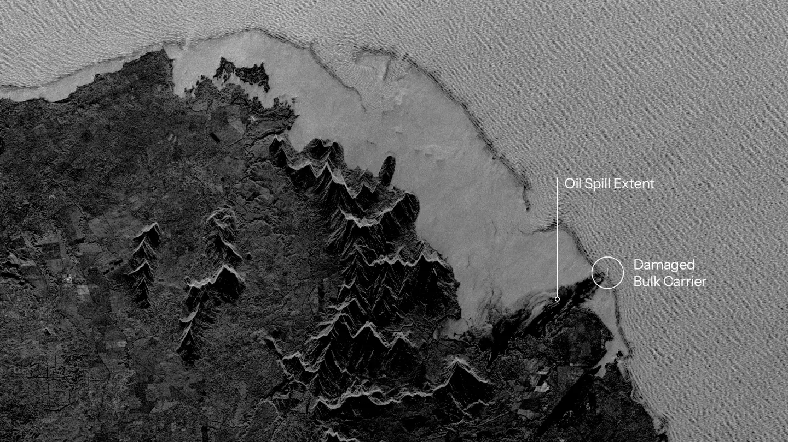
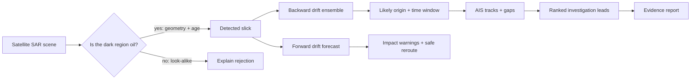
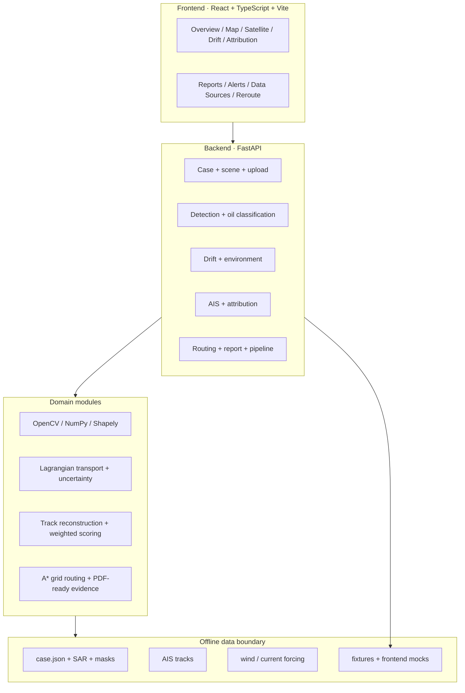
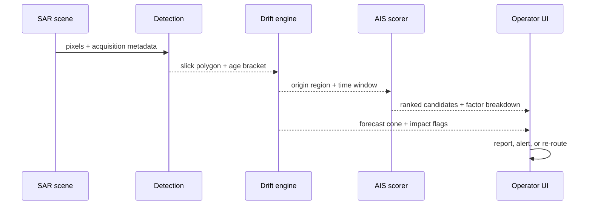
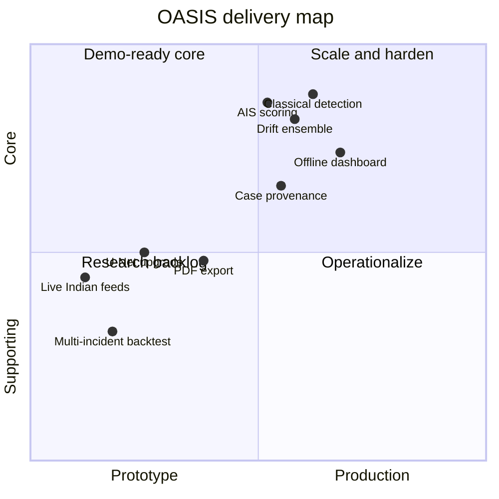

# OASIS

### Oil Analytics & Ship Intelligence System

> **From a dark patch in SAR imagery to an explainable investigation lead.**

OASIS is an offline-first maritime intelligence workbench for the SIH26143 / NTRO challenge. It combines satellite oil-slick detection, ocean-drift reconstruction, AIS vessel correlation, route safety, and evidence reporting in one dashboard.

<p align="center">
  
</p>

<p align="center">
  <a href="#quick-start">Quick start</a> ·
  <a href="#system-at-a-glance">Architecture</a> ·
  <a href="#dashboard">Dashboard</a> ·
  <a href="#api-surface">API</a> ·
  <a href="#validation">Validation</a>
</p>

## The problem in one picture



The output is deliberately a ranked, confidence-scored candidate list—not a verdict. Physics and AIS gaps are evidence signals, never proof of wrongdoing.

## Why OASIS

| Challenge | OASIS response |
|---|---|
| SAR dark spots have look-alikes | Classical segmentation plus morphology, texture, contrast, and physical rejection reasons |
| A slick moves after release | Bidirectional Lagrangian particle ensemble with 50% / 90% uncertainty cones |
| AIS is incomplete | Spatial, temporal, trajectory, heading, behavior, and AIS-gap factors are scored separately |
| Investigators need an audit trail | Provenance, parameters, evidence panels, and report content travel through the pipeline |
| Demos cannot depend on conference Wi-Fi | Bundled fixtures and synthetic forcing keep the complete UI usable offline |

## System at a glance



## Quick start

### 1. Start the API

Python **3.11 or 3.12** is required by the geospatial stack.

```bash
cd backend
uv venv --python 3.12 .venv
uv pip install --python .venv/bin/python -r requirements.txt
.venv/bin/uvicorn app.main:app --reload --port 8000
```

### 2. Start the dashboard

```bash
cd frontend
npm install
npm run dev                 # http://localhost:5173
```

Vite proxies `/api` to `localhost:8000`. If the API is unavailable, the UI automatically uses `frontend/src/mock/` and shows an `OFFLINE FIXTURES` badge.

```bash
VITE_FORCE_MOCK=1 npm run dev
```

### 3. Run the complete check

```bash
./scripts/check.sh
```

This checks the toolchain, case bundle, backend tests, frontend typecheck, API health, proxy behavior, and—when servers are running—the rendered UI. Use `./scripts/check.sh --serve` to start both services after verification. Logs go to `.run/`.

### Stack card

| Layer | Choices |
|---|---|
| UI | React 19, TypeScript, Vite, React Router, Tailwind CSS, MapLibre GL |
| API | FastAPI, Uvicorn, Pydantic v2 |
| Science | NumPy, SciPy, OpenCV, Rasterio, Shapely, Xarray, NetCDF4, Pandas |
| Intelligence | Classical SAR detector, optional U-Net seam, Lagrangian drift, weighted AIS scoring |
| Operations | A* grid routing, GeoJSON, ReportLab-ready report content |
| Data boundary | JSON/GeoJSON/Parquet/NPZ case bundle with deterministic fixture fallback |

## Dashboard

| Route | What it shows |
|---|---|
| `/` | Case overview, pipeline status, and live map summary |
| `/map` | Maritime map with slicks, tracks, cones, and layer toggles |
| `/satellite` | SAR scene upload, segmentation, geometry, look-alike reasoning, age proxy |
| `/drift` | Hindcast origin, forecast path, timeline, uncertainty, impact flags |
| `/vessel` | AIS track reconstruction and vessel intelligence |
| `/attribution` | Candidate shortlist, factors, flags, and explainable score breakdown |
| `/reroute` | Route planning and spill-aware re-planning |
| `/reports` | Evidence-style report view with provenance and limitations |
| `/alerts` | Maritime safety alerts and alert log |
| `/data` | Data-source and synthetic/real provenance view |

The intended operator journey is:

```text
Overview → Satellite Intelligence → Drift Intelligence → Attribution
       → Reroute Simulation → Reports
```

## Pipeline stages

### 1 · Detect and characterise

`backend/app/detection/` turns a SAR-like raster into oil and look-alike regions. The deterministic classical path includes local filtering, adaptive thresholding, connected components, morphology, geometry, contrast, edge evidence, and a low-confidence weathering/age proxy. U-Net support is optional and only enabled when weights are present.

**Typical outputs:** GeoJSON regions, area, perimeter, orientation, length/width, estimated age bracket, confidence, and physical rejection reasons.

### 2 · Reconstruct and forecast drift

`backend/app/drift/` advects particles with current, windage, and scale-dependent diffusion. The same model runs backward to estimate origin and forward to project impact. The UI renders the particle timeline, mode, 50% region, 90% region, and forecast warnings.

### 3 · Correlate AIS and rank leads

`backend/app/attribution/` parses tracks, detects reporting gaps, filters vessels by origin proximity and time window, then scores each candidate using independent factors such as:

```text
candidate score
  = proximity + time overlap + trajectory fit
  + heading alignment + behavior + AIS-gap signal
  + counterfactual drift similarity
```

Every factor is returned in the response. An AIS gap is labelled as a fact and an investigation signal—not an accusation.

### 4 · Protect operations and package evidence

`backend/app/routing/` provides grid/A* route planning and re-planning around spill cells. The report layer combines the detection, drift, attribution, source, processing-chain, and limitation sections into a report-ready response.

### Stage hand-off contract



Each hand-off is typed through Pydantic response models mirrored by `frontend/src/api/types.ts`. That keeps the dashboard, fixture mode, and live API on the same contract.

## Data and provenance

The frozen case is `gom-2023-06-15`. Build or refresh it with:

```bash
backend/.venv/bin/python scripts/build_case.py
```

| Input | Prototype status | Role |
|---|---|---|
| Zenodo oil mask `00250.tif` | Real | Slick morphology and evaluation mask |
| NOAA AccessAIS extract | Real | Vessel traffic and track reconstruction |
| SAR backscatter scene | Synthesised | Speckle, wind streaks, and oil/sea contrast |
| Look-alike patches | Synthesised | Negative examples for physical rejection |
| Wind/current field | Synthesised | Reproducible drift forcing and shear |
| Ground-truth polluter | Synthesised | Controlled AIS-dark validation target |

This is a **constructed validation scenario**: real SAR and AIS inputs are co-located for reproducible testing, and one polluter is injected. They do not describe one real-world incident. The dashboard is designed to keep that limitation visible.

Production data-source substitutions are straightforward: ISRO SAR for Sentinel-1, India's NAIS feed for AccessAIS, and INCOIS forcing for CMEMS/ERA5.

## Repository map

```text
.
├── backend/
│   ├── app/api/              REST routers for every pipeline stage
│   ├── app/core/             Pydantic contract, config, fixtures, case store
│   ├── app/detection/        Segmentation, geometry, volume, age, U-Net seam
│   ├── app/drift/            Fields, Lagrangian engine, cones, origin search
│   ├── app/attribution/      AIS ingest, gaps, filters, scoring
│   ├── app/environment/      Forcing providers and case-bundle resolver
│   ├── app/routing/          Grid routing and A* re-planning
│   └── tests/                Contract, physics, geometry, API, and scoring tests
├── frontend/
│   ├── src/pages/            Operator-facing dashboard routes
│   ├── src/components/       Map, panels, tables, timeline, layout
│   ├── src/api/              Typed client and response contracts
│   └── src/mock/             Offline fixture responses
├── ml/                       U-Net notebook and oil-type classification tools
├── scripts/                  Case builder, mock exporter, checks, render helper
├── data/case/                 Generated frozen bundle and manifest
├── data/raw/                  Optional source downloads
├── docs/                     Pipeline notes and demo script
├── PIPELINE_ML.md             Detailed implementation and model notes
├── plan.md                   Build plan and acceptance criteria
└── research.md               Domain, stakeholder, legal, and competitor research
```

## API surface

The FastAPI contract is defined in `backend/app/core/schemas.py` and exposed by `backend/app/main.py`.

| Area | Endpoints |
|---|---|
| Meta / case | `GET /health`, `GET /api/case`, `GET /api/pipeline/run` |
| Scenes / uploads | `GET /api/scene/sar.png`, `POST /api/upload`, `POST /api/detect/upload` |
| Detection | `POST /api/detect`, `POST /api/classify-oil` |
| Drift | `POST /api/drift/hindcast`, `POST /api/drift/forecast`, `POST /api/drift/origin-search` |
| Environment | `GET /api/environment`, `GET /api/environment/providers` |
| AIS / attribution | `GET /api/ais/tracks`, `POST /api/attribute` |
| Operations | `POST /api/vessel/reroute`, `POST /api/plan`, `POST /api/replan` |
| Reporting | `POST /api/report` |

Interactive API documentation is available at `http://localhost:8000/docs` when the backend is running.

## Validation

Measured on the frozen case against the official Zenodo mask:

| Signal | Result |
|---|---:|
| Detection IoU | **0.878** |
| Recall / precision | **0.931 / 0.939** |
| Slick area | **15.9 km²** vs 16.0 km² truth |
| Look-alikes rejected | **2 / 2** |
| Age bracket | **4.5–19.1 h**; low confidence by design |
| Hindcast origin error | **7.7 km** |
| 90% origin region | Contains the true origin |
| Drift runtime | **38 ms** in the reference test |

Run the focused checks:

```bash
cd backend
.venv/bin/python -m pytest -q
.venv/bin/python -m pytest tests/test_detection.py -q
```

Frontend type safety:

```bash
cd frontend
npm run typecheck
npm run build
```

## Engineering principles

<table>
<tr><td>🛰️ <b>Offline-first</b></td><td>The demo keeps working with local bundles and fixtures.</td></tr>
<tr><td>🧭 <b>Uncertainty is a cone</b></td><td>Origins are regions and time windows, not false-precision pins.</td></tr>
<tr><td>⚖️ <b>Rank, never accuse</b></td><td>Candidate scores explain evidence; they do not establish guilt.</td></tr>
<tr><td>🧪 <b>Fallback before headline</b></td><td>Deterministic paths remain available when ML weights or live forcing are absent.</td></tr>
<tr><td>🔎 <b>Show the caveat</b></td><td>Constructed data, low-confidence age, and AIS gaps stay visible in the product.</td></tr>
</table>

## Current scope and next steps



Near-term hardening includes real forcing/provider adapters, multi-incident calibration, higher-fidelity weathering and transport physics, production SAR/AIS connectors, and a finished PDF download path. The current implementation is a best-effort triage and evidence-support tool, not continuous surveillance or a legal decision-maker.

## Further reading

- [Pipeline implementation notes](PIPELINE_ML.md)
- [Detailed pipeline design](docs/PIPELINE.md)
- [Seven-minute demo script](docs/DEMO_SCRIPT.md)
- [Build plan and acceptance criteria](plan.md)
- [Domain and stakeholder research](research.md)

## License / project context

Built for **Smart India Hackathon — SIH26143**, the NTRO problem statement on satellite oil-spill detection and AIS-based vessel correlation. Add project-specific licensing and team attribution here before public release.
